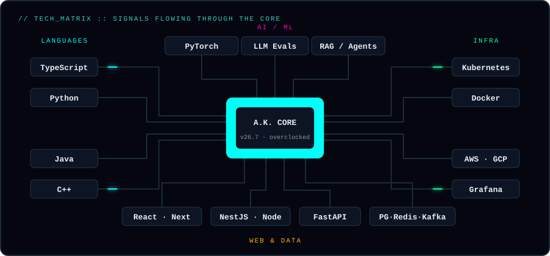

  

  

  

<h3 align="center"><code>⚡ DEPLOYED SYSTEMS — click to inspect</code></h3>

<table align="center">
  <tr>
    <td>
      
    </td>
    <td>
      
    </td>
  </tr>
  <tr>
    <td>
      
    </td>
    <td>
      
    </td>
  </tr>
</table>

  

  

  

<h3 align="center"><code>📡 OPEN CHANNELS</code></h3>

  
  &nbsp;
  
  &nbsp;
  

 

  

