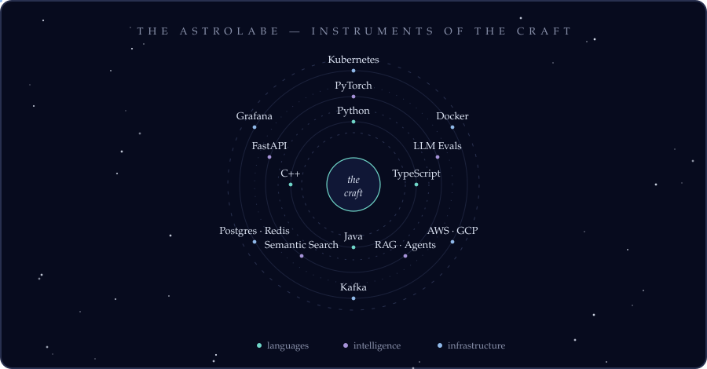

  

  

  

<h4 align="center"><em>Selected Works — click any to explore</em></h4>

<table align="center">
  <tr>
    <td>
      
    </td>
    <td>
      
    </td>
  </tr>
  <tr>
    <td>
      
    </td>
    <td>
      
    </td>
  </tr>
</table>

  

  

  

  
  &nbsp;
  
  &nbsp;
  

 

  

